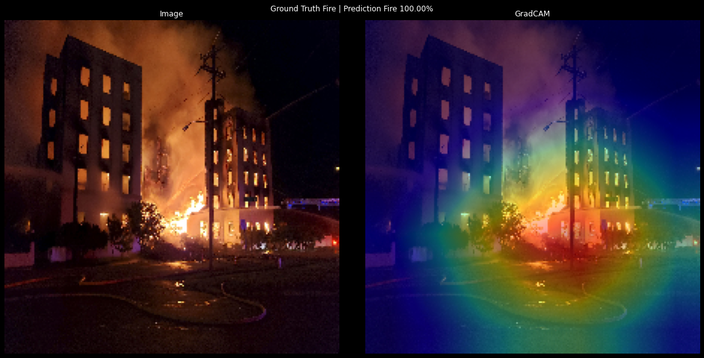

# Fire Robbery Accident Detection GradCAM

## Dataset

- [Robbery_Accident_Fire_Database](https://drive.google.com/file/d/11KBgD_W2yOxhJnUMiyBkBzXDPXhVmvCt/view?usp=sharing)

## Dependency

- Python 3
- TensorFlow 2+
- matplotlib
- numpy
- OpenCV

## Reference

- https://keras.io/examples/vision/grad_cam